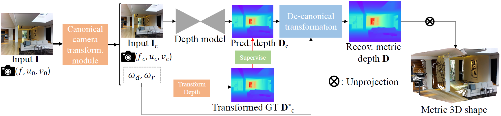
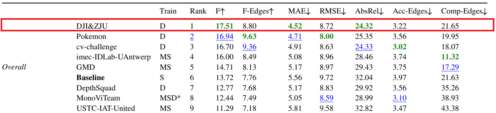
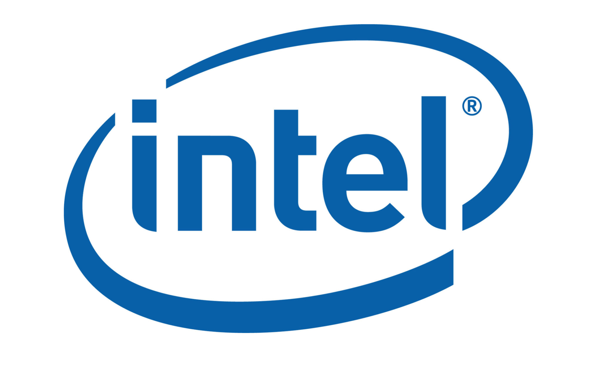

# 🚀 MetricDepth (ICCV23) 🚀

**The is official PyTorch implementation of paper "Metric3D: Towards Zero-shot Metric 3D Prediction from A Single Image" (Metric 3D)**

Authors: [Wei Yin](https://yvanyin.net/)<sup>1*</sup>,
[Chi Zhang](https://icoz69.github.io/)<sup>2*</sup>,
[Hao Chen](https://scholar.google.com/citations?hl=zh-CN&user=i-2ghuYAAAAJ)<sup>3</sup>,
[Zhipeng Cai](https://zhipengcai.github.io/)<sup>3</sup>,
[Gang Yu](https://www.skicyyu.org/)<sup>4</sup>,
[Kaixuan Wang](https://wang-kx.github.io/)<sup>1</sup>,
[Xiaozhi Chen](https://xiaozhichen.github.io/)<sup>1</sup>,
[Chunhua Shen](https://cshen.github.io/)<sup>3</sup>

### [Arxiv](https://arxiv.org/abs/2307.10984) | [Video](https://www.youtube.com/playlist?list=PLEuyXJsWqUNd04nwfm9gFBw5FVbcaQPl3) | Hugging Face 🤗 (Comming Soon)
[@JUGGHM](https://github.com/JUGGHM)<sup>1,5</sup>  will also maintain this project. 

### The Champion of [2nd Monocular Depth Estimation Challenge](https://jspenmar.github.io/MDEC) in CVPR 2023
### Zero-shot testing on NYU and KITTI, Comparable with SoTA Supervised methods

## News and TO DO LIST
- [ ] Stronger models and tiny models
- [ ] Hugging face
- `[2023/8/10]` Inference codes, pretrained weights, and demo released.

##  🌼 Abstract

<div align=center>

</div>

Existing monocular metric depth estimation methods can only handle a single camera model and are unable to perform mixed-data training due to the metric ambiguity. Meanwhile, SOTA monocular methods trained on large mixed datasets achieve zero-shot generalization by learning affine-invariant depths, which cannot recover real-world metrics. In this work, we show that the key to a zero-shot single-view metric depth model lies in the combination of large-scale data training and resolving the metric ambiguity from various camera models. We propose a canonical camera space transformation module, which explicitly addresses the ambiguity problems and can be effortlessly plugged into existing monocular models. Equipped with our module, monocular models can be stably trained over **8 Million images** with **several Kilo camera models**, resulting in **zero-shot** generalization to **in-the-wild** images with unseen camera set.

## 🎩 Fully zero-shot state-of-the-art mono-depth

### Highlights: The Champion 🏆 of [2nd Monocular Depth Estimation Challenge](https://jspenmar.github.io/MDEC) in CVPR 2023 

<div align=center>

</div>

### Routing benchmarks 

WITHOUT re-training the models on target datasets, we obtain comparable performance against SoTA supervised methods Adabins and NewCRFs.

|         | Backbone   | KITTI $\delta 1$ ↑ | KITTI $\delta 2$  ↑ | KITTI $\delta 3$ ↑ | KITTI AbsRel  ↓| KITTI RMSE  ↓| KITTI log10  ↓| NYU $\delta 1$ ↑ | NYU $\delta 2$ ↑ | NYU $\delta 3$ ↑ | NYU AbsRel  ↓| NYU RMSE  ↓| NYU RMSE-log  ↓|
|---------|------------|---|---|---|---|---|---|---|---|---|---|---|---|
| Adabins | Efficient-B5 | 0.964 | 0.995 | 0.999 | 0.058  |  2.360 | 0.088  | 0.903  | 0.984  | 0.997  | 0.103  | 0.0444  | 0.364 |
| NewCRFs | SwinT-L | 0.974 | 0.997 | 0.999 | 0.052  |  2.129 | 0.079  | 0.922  | 0.983  | 0.994  | 0.095  | 0.041  | 0.334 |
| Ours (CSTM_label) | ConvNeXt-L |      0.964      | 0.993   | 0.998  | 0.058 | 2.770  | 0.092  | 0.944  |  0.986 | 0.995   | 0.083  |  0.035 |  0.310 |

## 🌈 DEMOs
### In-the-wild 3D reconstruction

|           | Image | Reconstruction | Pointcloud File |
|:---------:|:------------------:|:------------------:|:--------:|
|    room   |         |                 |  [Download](https://drive.google.com/file/d/1P1izSegH2c4LUrXGiUksw037PVb0hjZr/view?usp=drive_link)        |
| Colosseum |         |              |     [Download](https://drive.google.com/file/d/1jJCXe5IpxBhHDr0TZtNZhjxKTRUz56Hg/view?usp=drive_link)     |
|   chess   |         |                 |      [Download](https://drive.google.com/file/d/1oV_Foq25_p-tTDRTcyO2AzXEdFJQz-Wm/view?usp=drive_link)    |

All three images are downloaded from [unplash](https://unsplash.com/) and put in the data/wild_demo directory.

### 3D metric reconstruction, Metric3D × DroidSLAM
Metric3D can also provide scale information for DroidSLAM, help to solve the scale drift problem for better trajectories. (Left: Droid-SLAM (mono). Right: Droid-SLAM with Metric-3D)

#### Bird Eyes' View (Left: Droid-SLAM (mono). Right: Droid-SLAM with Metric-3D)

<div align=center>
 
</div>

#### Front View

<div align=center>
 
</div>

#### KITTI odemetry evaluation (Translational RMS drift (t_rel, ↓) / Rotational RMS drift (r_rel, ↓))
|            | Modality |   seq 00   |   seq 02   |   seq 05  |   seq 06   |   seq 08   |   seq 09  |   seq 10  |
|:----------:|:--------:|:----------:|:----------:|:---------:|:----------:|:----------:|:---------:|:---------:|
|  ORB-SLAM2 |   Mono   | 11.43/0.58 | 10.34/0.26 | 9.04/0.26 | 14.56/0.26 | 11.46/0.28 |  9.3/0.26 | 2.57/0.32 |
| Droid-SLAM |   Mono   |  33.9/0.29 | 34.88/0.27 | 23.4/0.27 |  17.2/0.26 |  39.6/0.31 | 21.7/0.23 |   7/0.25  |
| Droid+Ours |   Mono   |  1.44/0.37 |  2.64/0.29 | 1.44/0.25 |   0.6/0.2  |   2.2/0.3  | 1.63/0.22 | 2.73/0.23 |
|  ORB-SLAM2 |  Stereo  |  0.88/0.31 |  0.77/0.28 | 0.62/0.26 |  0.89/0.27 |  1.03/0.31 | 0.86/0.25 | 0.62/0.29 |

Metric3D makes the mono-SLAM scale-aware, like stereo systems.

#### KITTI sequence videos - Youtube
[2011_09_30_drive_0028](https://youtu.be/gcTB4MgVCLQ) /
[2011_09_30_drive_0033](https://youtu.be/He581fmoPP4) /
[2011_09_30_drive_0034](https://youtu.be/I3PkukQ3_F8)

videos - Bilibili (TODO)

#### Estimated pose
[2011_09_30_drive_0033](https://drive.google.com/file/d/1SMXWzLYrEdmBe6uYMR9ShtDXeFDewChv/view?usp=drive_link) / 
[2011_09_30_drive_0034](https://drive.google.com/file/d/1ONU4GxpvTlgW0TjReF1R2i-WFxbbjQPG/view?usp=drive_link) /
[2011_10_03_drive_0042](https://drive.google.com/file/d/19fweg6p1Q6TjJD2KlD7EMA_aV4FIeQUD/view?usp=drive_link)

#### Pointcloud files
[2011_09_30_drive_0033](https://drive.google.com/file/d/1K0o8DpUmLf-f_rue0OX1VaHlldpHBAfw/view?usp=drive_link) /
[2011_09_30_drive_0034](https://drive.google.com/file/d/1bvZ6JwMRyvi07H7Z2VD_0NX1Im8qraZo/view?usp=drive_link) /
[2011_10_03_drive_0042](https://drive.google.com/file/d/1Vw59F8nN5ApWdLeGKXvYgyS9SNKHKy4x/view?usp=drive_link)

## 🔨 Installation
### One-line Installation
```bash
pip install -r requirements.txt
```
Or you could also try:

#### 30 series GPUs, pytorch1.10
```bash
conda create -n metric3d python=3.7
conda activate metric3d
pip install torch==1.10.0+cu111 torchvision==0.11.0+cu111 torchaudio==0.10.0 -f https://download.pytorch.org/whl/torch_stable.html
pip install -r requirements.txt
pip install -U openmim
mim install mmengine
mim install "mmcv-full==1.3.17"
pip install "mmsegmentation==0.19.0"
```

#### 40 series GPUs, pytorch2.0
```bash
conda create -n metric3d python=3.8
conda activate metric3d
pip3 install torch torchvision torchaudio
pip install -r requirements.txt
pip install -U openmim
mim install mmengine
mim install "mmcv-full==1.7.1"
pip install "mmsegmentation==0.30.0"
pip install numpy==1.20.0
pip install scikit-image==0.18.0
```

### dataset annotation components
With off-the-shelf depth datasets, we need to generate json annotaions in compatible with this dataset, which is organized by:
```
dict(
	'files':list(
		dict(
			'rgb': 'data/kitti_demo/rgb/xxx.png',
			'depth': 'data/kitti_demo/depth/xxx.png',
			'depth_scale': 1000.0 # the depth scale of gt depth img.
			'cam_in': [fx, fy, cx, cy],
		),

		dict(
			...
		),

		...
	)
)
```
To generate such annotations, please refer to the "Inference" section.

### configs
In ```mono/configs``` we provide different config setups. 

Intrinsics of the canonical camera is set bellow: 
```
    canonical_space = dict(
        focal_length=1000.0,
    ),
```
where cx and cy is set to be half of the image size. You do not need to adjust the canonical focal length, otherwise the metric is not accurate. 

Inference settings are defined as
```
    crop_size = (512, 1088),
```
where the images will be resized and padded as the ```crop_size``` and then fed into the model.

## ✈️ Inference
### Download Checkpoint
|      | Encoder | Decoder | Link |
|:----:|:-------:|:-------:|:-------:|
| v1.0 |  ConvNeXt-L |   Hourglass-Decoder |  [Download](https://drive.google.com/file/d/1KVINiBkVpJylx_6z1lAC7CQ4kmn-RJRN/view?usp=drive_link)|

More models are on the way...

### Dataset Mode
1. put the trained ckpt file ```model.pth``` in ```weight/```.
2. generate data annotation by following the code ```data/gene_annos_kitti_demo.py```, which includes 'rgb', (required) 'intrinsic', (required) 'depth', (optional) 'depth_scale'. Note the 'depth_scale' is the scale factor for GT labels. e.g. to keep the precision, the kitti GT depths are scaled with 256. 
3. change the 'test_data_path' in ```test_*.sh``` to the ```*.json``` path. 
4. run ```source test_kitti.sh``` or ```source test_nyu.sh```.

### In-the-Wild Mode
1. put the trained ckpt file ```model.pth``` in ```weight/```.
2. change the 'test_data_path' in ```test.sh``` to the image folder path. 
3. run ```source test.sh```.
Note: if you do not know the intrinsics, we will randomly set the intrinsic parameters. The problem is the predicted depth has no metric. However, if you know the paired focal length, please modify the following code in ```mono/utils/custom_data.py```. Set the 'intrinsic' with the format [fx, fy, cx, cy].
```
def load_data(path: str):
    rgbs = glob.glob(path + '/*.jpg') + glob.glob(path + '/*.png')
    data = [{'rgb':i, 'depth':None, 'intrinsic': None, 'filename':os.path.basename(i), 'folder': i.split('/')[-3]} for i in rgbs]
    return data
```

## ❓ Q & A
### Q1.1: Why depth maps look good but pointclouds are distorted?
Because the focal length is not properly set! Please find a proper focal length by modifying codes [here](mono/utils/do_test.py#309) yourself.  

### Q1.2: Why depth maps look good but scales are not precise?
If the intrinsics are correct, please try different **resolutions** for  ``` crop_size = (512, 1088) ``` in the config file. From our experience, you could try (544, 928), (768, 1088), (512, 992), (480, 1216), (1216, 1952), or some resolutions close to them as you like. Generally, larger resolutions are better for driving scenarios and smaller ones for indoors.  

### Q2: Why the pointclouds are too slow to be generated?
Because the images are too large! Use smaller ones instead. 

### Q3: Why predicted depth maps are not satisfactory?
First be sure all black padding regions at image boundaries are cropped out. Besides, metric 3D is not almighty. Some objects (chandeliers, drones...) / camera views (aerial view, bev...) do not occur frequently in the training datasets. We will going deeper into this and release more powerful solutions.

## 🍭 Acknowledgement
This work is empowered by DJI Automotive<sup>1</sup>

<div align=center>

</div>

and collaborators from
Tencent<sup>2</sup>, ZJU<sup>3</sup>, Intel Labs<sup>4</sup>, and HKUST<sup>5</sup>

   

We appreciate efforts from the contributors of [mmcv](https://github.com/open-mmlab/mmcv), all concerning datasets, and [NVDS](https://github.com/RaymondWang987/NVDS).

## 📧 Citation
```
@article{yin2023metric,
  title={Metric3D: Towards Zero-shot Metric 3D Prediction from A Single Image},
  author={Wei Yin, Chi Zhang, Hao Chen, Zhipeng Cai, Gang Yu, Kaixuan Wang, Xiaozhi Chen, Chunhua Shen},
  booktitle={ICCV},
  year={2023}
}
```

## License and Contact

The *Metric 3D* code is under a GPLv3 License for non-commercial usage. For further questions, contact Dr. Wei Yin  [yvanwy@outlook.com] and Mr. Mu Hu [mhuam@connect.ust.hk].
