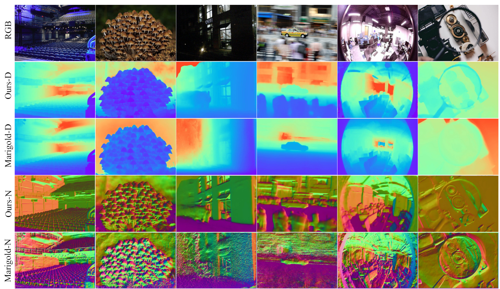
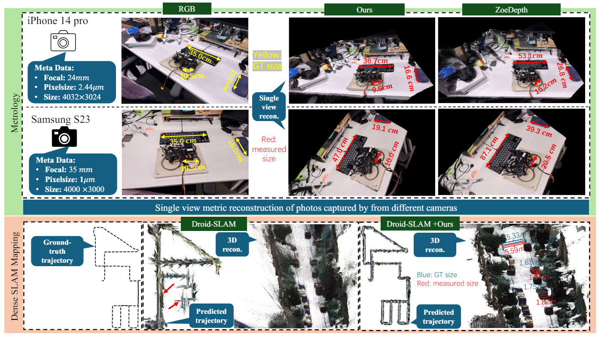

# 🚀 Metric3D Project 🚀

**Official PyTorch implementation of Metric3Dv1 and Metric3Dv2:**   

[1] [Metric3D: Towards Zero-shot Metric 3D Prediction from A Single Image](https://arxiv.org/abs/2307.10984)  

[2] [Metric3Dv2: A Versatile Monocular Geometric Foundation Model for Zero-shot Metric Depth and Surface Normal Estimation](https://arxiv.org/abs/2404.15506)

<a href='https://jugghm.github.io/Metric3Dv2'></a>
<a href='https://arxiv.org/abs/2307.10984'></a>
<a href='https://arxiv.org/abs/2404.15506'></a>
<a href='https://huggingface.co/spaces/JUGGHM/Metric3D'></a>

[//]: # (### [Project Page]&#40;https://arxiv.org/abs/2307.08695&#41; | [v2 Paper]&#40;https://arxiv.org/abs/2307.10984&#41; | [v1 Arxiv]&#40;https://arxiv.org/abs/2307.10984&#41; | [Video]&#40;https://www.youtube.com/playlist?list=PLEuyXJsWqUNd04nwfm9gFBw5FVbcaQPl3&#41; | [Hugging Face 🤗]&#40;https://huggingface.co/spaces/JUGGHM/Metric3D&#41; )

[](https://paperswithcode.com/sota/monocular-depth-estimation-on-nyu-depth-v2?p=metric3d-v2-a-versatile-monocular-geometric-1) 

[](https://paperswithcode.com/sota/monocular-depth-estimation-on-kitti-eigen?p=metric3d-v2-a-versatile-monocular-geometric-1) 

[](https://paperswithcode.com/sota/surface-normals-estimation-on-nyu-depth-v2-1?p=metric3d-v2-a-versatile-monocular-geometric-1) 

[](https://paperswithcode.com/sota/surface-normals-estimation-on-ibims-1?p=metric3d-v2-a-versatile-monocular-geometric-1) 

[](https://paperswithcode.com/sota/surface-normals-estimation-on-scannetv2?p=metric3d-v2-a-versatile-monocular-geometric-1) 

🏆 **Champion in [CVPR2023 Monocular Depth Estimation Challenge](https://jspenmar.github.io/MDEC)**

## News 
- `[2024/8]` Metric3Dv2 is accepted by TPAMI!
- `[2024/7/5]` Our stable-diffusion alternative GeoWizard has now been accepted by ECCV 2024! Check NOW the [repository](https://github.com/fuxiao0719/GeoWizard) and [paper](https://arxiv.org/abs/2403.12013) for the finest-grained geometry ever! 🎉🎉🎉
- `[2024/6/25]` Json files for KITTI datasets now available! Refer to [Training](./training/README.md) for more details 
- `[2024/6/3]` ONNX is supported! We appreciate [@xenova](https://github.com/xenova) for their remarkable efforts! 
- `[2024/4/25]` Weights for ViT-giant2 model released!  
- `[2024/4/11]` Training codes are released!
- `[2024/3/18]` [HuggingFace 🤗](https://huggingface.co/spaces/JUGGHM/Metric3D) GPU version updated!
- `[2024/3/18]` [Project page](https://jugghm.github.io/Metric3Dv2/) released!
- `[2024/3/18]` Metric3D V2 models released, supporting metric depth and surface normal now!
- `[2023/8/10]` Inference codes, pre-trained weights, and demo released.
- `[2023/7]` Metric3D accepted by ICCV 2023!
- `[2023/4]` The Champion of [2nd Monocular Depth Estimation Challenge](https://jspenmar.github.io/MDEC) in CVPR 2023

##  🌼 Abstract
Metric3D is a strong and robust geometry foundation model for high-quality and zero-shot **metric depth** and **surface normal** estimation from a single image. It excels at solving in-the-wild scene reconstruction. It can directly help you measure the size of structures from a single image. Now it achieves SOTA performance on over 10 depth and normal benchmarks.






##  📝 Benchmarks 

### Metric Depth

[//]: # (#### Zero-shot Testing)

[//]: # (Our models work well on both indoor and outdoor scenarios, compared with other zero-shot metric depth estimation methods.)

[//]: # ()
[//]: # (|                 | Backbone   | KITTI $\delta 1$ ↑ | KITTI $\delta 2$  ↑ | KITTI $\delta 3$ ↑ | KITTI AbsRel  ↓ | KITTI RMSE  ↓ | KITTI RMS_log  ↓ | NYU $\delta 1$ ↑ | NYU $\delta 2$ ↑ | NYU $\delta 3$ ↑ | NYU AbsRel  ↓ | NYU RMSE  ↓ | NYU log10  ↓ |)

[//]: # (|-----------------|------------|--------------------|---------------------|--------------------|-----------------|---------------|------------------|------------------|------------------|------------------|---------------|-------------|--------------|)

[//]: # (| ZeroDepth       | ResNet-18 | 0.910              | 0.980               | 0.996              | 0.057           | 4.044         | 0.083            | 0.901            | 0.961            | -                | 0.100         | 0.380       | -            |)

[//]: # (| PolyMax         | ConvNeXt-L    | -                  | -                   | -                  | -               | -             | -                | 0.969            | 0.996            | 0.999            | 0.067         | 0.250       | 0.033        |)

[//]: # (| Ours | ViT-L     | 0.985              | 0.995               | 0.999              | 0.052           | 2.511         | 0.074            | 0.975            | 0.994            | 0.998            | 0.063         | 0.251       | 0.028        |)

[//]: # (| Ours | ViT-g2    | 0.989              | 0.996               | 0.999              | 0.051           | 2.403         | 0.080            | 0.980            | 0.997            | 0.999            | 0.067         | 0.260       | 0.030        |)

[//]: # ()
[//]: # ([//]: # &#40;| Adabins | Efficient-B5 | 0.964 | 0.995 | 0.999 | 0.058  |  2.360 | 0.088            | 0.903  | 0.984  | 0.997  | 0.103  | 0.0444  | 0.364 |&#41;)
[//]: # ([//]: # &#40;| NewCRFs | SwinT-L | 0.974 | 0.997 | 0.999 | 0.052  |  2.129 | 0.079            | 0.922  | 0.983  | 0.994  | 0.095  | 0.041  | 0.334 |&#41;)
[//]: # ([//]: # &#40;| Ours &#40;CSTM_label&#41; | ConvNeXt-L |      0.964      | 0.993   | 0.998  | 0.058 | 2.770  | 0.092            | 0.944  |  0.986 | 0.995   | 0.083  |  0.035 |  0.310 |&#41;)

[//]: # (#### Finetuned)
Our models rank 1st on the routing KITTI and NYU benchmarks.

|               | Backbone    | KITTI δ1 ↑ | KITTI δ2  ↑  | KITTI AbsRel  ↓ | KITTI RMSE  ↓ | KITTI RMS_log  ↓ | NYU δ1 ↑ | NYU δ2 ↑  | NYU AbsRel  ↓ | NYU RMSE  ↓ | NYU log10  ↓ |
|---------------|-------------|------------|-------------|-----------------|---------------|------------------|----------|----------|---------------|-------------|--------------|
| ZoeDepth      | ViT-Large   | 0.971      | 0.995                  | 0.053           | 2.281         | 0.082            | 0.953    | 0.995        | 0.077         | 0.277       | 0.033        |
| ZeroDepth     | ResNet-18   | 0.968      | 0.996                   | 0.057           | 2.087         | 0.083            | 0.954    | 0.995           | 0.074         | 0.269       | 0.103        |
| IEBins        | SwinT-Large | 0.978      | 0.998                  | 0.050           | 2.011         | 0.075            | 0.936    | 0.992           | 0.087         | 0.314       | 0.031        |
| DepthAnything | ViT-Large   | 0.982      | 0.998                  | 0.046           | 1.985         | 0.069            | 0.984    | 0.998           | 0.056         | 0.206       | 0.024        |
| Ours          | ViT-Large   | 0.985      | 0.998       | 0.044                        | 1.985         | 0.064            | 0.989    | 0.998           | 0.047         | 0.183       | 0.020        |
| Ours          | ViT-giant2  | 0.989      | 0.998       | 0.039                        | 1.766         | 0.060            | 0.987    | 0.997           | 0.045         | 0.187       | 0.015        |

### Affine-invariant Depth
Even compared to recent affine-invariant depth methods (Marigold and Depth Anything), our metric-depth (and normal) models still show superior performance. 

|                       | #Data for Pretrain and Train                 | KITTI Absrel ↓ | KITTI δ1 ↑ | NYUv2 AbsRel  ↓ | NYUv2 δ1 ↑ | DIODE-Full AbsRel ↓ | DIODE-Full δ1 ↑ | Eth3d AbsRel  ↓ | Eth3d δ1 ↑ |
|-----------------------|----------------------------------------------|----------------|------------|-----------------|------------|---------------------|-----------------|----------------------|------------|
| OmniData (v2, ViT-L)       | 1.3M + 12.2M                                 | 0.069          | 0.948      | 0.074           | 0.945      | 0.149               | 0.835           | 0.166                | 0.778      | 
| MariGold  (LDMv2)     | 5B + 74K                                     | 0.099          | 0.916      | 0.055           | 0.961      | 0.308               | 0.773           | 0.127                | 0.960      | 
| DepthAnything (ViT-L) | 142M + 63M                                   | 0.076          | 0.947      | 0.043           | 0.981      | 0.277               | 0.759           | 0.065                | 0.882      | 
| Ours (ViT-L)          | 142M + 16M                                   | 0.042          | 0.979      | 0.042           | 0.980      | 0.141               | 0.882           | 0.042                | 0.987      | 
| Ours (ViT-g)          | 142M + 16M                                   | 0.043          | 0.982      | 0.043           | 0.981      | 0.136               | 0.895           | 0.042                | 0.983      | 


### Surface Normal
Our models also show powerful performance on normal benchmarks.

|              | NYU 11.25° ↑ | NYU Mean ↓ | NYU RMS ↓ | ScanNet 11.25° ↑ | ScanNet Mean ↓ | ScanNet RMS ↓ | iBims 11.25° ↑ | iBims Mean ↓ | iBims RMS ↓ | 
|--------------|----------|----------|-----------|-----------------|----------------|--------------|---------------|--------------|-------------|
| EESNU        | 0.597    | 16.0     | 24.7      | 0.711           | 11.8           | 20.3         | 0.585         | 20.0         | -           | 
| IronDepth    | -        | -        | -         | -               | -              | -            | 0.431         | 25.3         | 37.4        | 
| PolyMax      | 0.656    | 13.1     | 20.4      | -               | -              | -            | -             | -            | -           |
| Ours (ViT-L) | 0.688    | 12.0     | 19.2      | 0.760           | 9.9            | 16.4         | 0.694         | 19.4         | 34.9        | 
| Ours (ViT-g)   | 0.662    | 13.2     | 20.2      | 0.778           | 9.2            | 15.3         | 0.697         | 19.6         | 35.2        |


## 🌈 DEMOs

### Zero-shot monocular metric depth & surface normal
  


### Zero-shot metric 3D recovery
  

### Improving monocular SLAM
  

[//]: # (https://github.com/YvanYin/Metric3D/assets/35299633/f95815ef-2506-4193-a6d9-1163ea821268)

[//]: # (https://github.com/YvanYin/Metric3D/assets/35299633/ed00706c-41cc-49ea-accb-ad0532633cc2)

[//]: # (### Zero-shot metric 3D recovery)

[//]: # (https://github.com/YvanYin/Metric3D/assets/35299633/26cd7ae1-dd5a-4446-b275-54c5ca7ef945)

[//]: # (https://github.com/YvanYin/Metric3D/assets/35299633/21e5484b-c304-4fe3-b1d3-8eebc4e26e42)
[//]: # (### Monocular reconstruction for a Sequence)

[//]: # ()
[//]: # (### In-the-wild 3D reconstruction)

[//]: # ()
[//]: # (|           | Image | Reconstruction | Pointcloud File |)

[//]: # (|:---------:|:------------------:|:------------------:|:--------:|)

[//]: # (|    room   |         |                 |  [Download]&#40;https://drive.google.com/file/d/1P1izSegH2c4LUrXGiUksw037PVb0hjZr/view?usp=drive_link&#41;        |)

[//]: # (| Colosseum |         |              |     [Download]&#40;https://drive.google.com/file/d/1jJCXe5IpxBhHDr0TZtNZhjxKTRUz56Hg/view?usp=drive_link&#41;     |)

[//]: # (|   chess   |         |                 |      [Download]&#40;https://drive.google.com/file/d/1oV_Foq25_p-tTDRTcyO2AzXEdFJQz-Wm/view?usp=drive_link&#41;    |)

[//]: # ()
[//]: # (All three images are downloaded from [unplash]&#40;https://unsplash.com/&#41; and put in the data/wild_demo directory.)

[//]: # ()
[//]: # (### 3D metric reconstruction, Metric3D × DroidSLAM)

[//]: # (Metric3D can also provide scale information for DroidSLAM, help to solve the scale drift problem for better trajectories. )

[//]: # ()
[//]: # (#### Bird Eyes' View &#40;Left: Droid-SLAM &#40;mono&#41;. Right: Droid-SLAM with Metric-3D&#41;)

[//]: # ()
[//]: # (<div align=center>)

[//]: # ( )

[//]: # (</div>)

[//]: # ()
[//]: # (### Front View)

[//]: # ()
[//]: # (<div align=center>)

[//]: # ( )

[//]: # (</div>)

[//]: # ()
[//]: # (#### KITTI odemetry evaluation &#40;Translational RMS drift &#40;t_rel, ↓&#41; / Rotational RMS drift &#40;r_rel, ↓&#41;&#41;)

[//]: # (|            | Modality |   seq 00   |   seq 02   |   seq 05  |   seq 06   |   seq 08   |   seq 09  |   seq 10  |)

[//]: # (|:----------:|:--------:|:----------:|:----------:|:---------:|:----------:|:----------:|:---------:|:---------:|)

[//]: # (|  ORB-SLAM2 |   Mono   | 11.43/0.58 | 10.34/0.26 | 9.04/0.26 | 14.56/0.26 | 11.46/0.28 |  9.3/0.26 | 2.57/0.32 |)

[//]: # (| Droid-SLAM |   Mono   |  33.9/0.29 | 34.88/0.27 | 23.4/0.27 |  17.2/0.26 |  39.6/0.31 | 21.7/0.23 |   7/0.25  |)

[//]: # (| Droid+Ours |   Mono   |  1.44/0.37 |  2.64/0.29 | 1.44/0.25 |   0.6/0.2  |   2.2/0.3  | 1.63/0.22 | 2.73/0.23 |)

[//]: # (|  ORB-SLAM2 |  Stereo  |  0.88/0.31 |  0.77/0.28 | 0.62/0.26 |  0.89/0.27 |  1.03/0.31 | 0.86/0.25 | 0.62/0.29 |)

[//]: # ()
[//]: # (Metric3D makes the mono-SLAM scale-aware, like stereo systems.)

[//]: # ()
[//]: # (#### KITTI sequence videos - Youtube)

[//]: # ([2011_09_30_drive_0028]&#40;https://youtu.be/gcTB4MgVCLQ&#41; /)

[//]: # ([2011_09_30_drive_0033]&#40;https://youtu.be/He581fmoPP4&#41; /)

[//]: # ([2011_09_30_drive_0034]&#40;https://youtu.be/I3PkukQ3_F8&#41;)

[//]: # ()
[//]: # (#### Estimated pose)

[//]: # ([2011_09_30_drive_0033]&#40;https://drive.google.com/file/d/1SMXWzLYrEdmBe6uYMR9ShtDXeFDewChv/view?usp=drive_link&#41; / )

[//]: # ([2011_09_30_drive_0034]&#40;https://drive.google.com/file/d/1ONU4GxpvTlgW0TjReF1R2i-WFxbbjQPG/view?usp=drive_link&#41; /)

[//]: # ([2011_10_03_drive_0042]&#40;https://drive.google.com/file/d/19fweg6p1Q6TjJD2KlD7EMA_aV4FIeQUD/view?usp=drive_link&#41;)

[//]: # ()
[//]: # (#### Pointcloud files)

[//]: # ([2011_09_30_drive_0033]&#40;https://drive.google.com/file/d/1K0o8DpUmLf-f_rue0OX1VaHlldpHBAfw/view?usp=drive_link&#41; /)

[//]: # ([2011_09_30_drive_0034]&#40;https://drive.google.com/file/d/1bvZ6JwMRyvi07H7Z2VD_0NX1Im8qraZo/view?usp=drive_link&#41; /)

[//]: # ([2011_10_03_drive_0042]&#40;https://drive.google.com/file/d/1Vw59F8nN5ApWdLeGKXvYgyS9SNKHKy4x/view?usp=drive_link&#41;)

## 🔨 Installation
### One-line Installation
For the ViT models, use the following environment：
```bash
pip install -r requirements_v2.txt
```

For ConvNeXt-L, it is 
```bash
pip install -r requirements_v1.txt
```

### dataset annotation components
With off-the-shelf depth datasets, we need to generate json annotaions in compatible with this dataset, which is organized by:
```
dict(
	'files':list(
		dict(
			'rgb': 'data/kitti_demo/rgb/xxx.png',
			'depth': 'data/kitti_demo/depth/xxx.png',
			'depth_scale': 1000.0 # the depth scale of gt depth img.
			'cam_in': [fx, fy, cx, cy],
		),

		dict(
			...
		),

		...
	)
)
```
To generate such annotations, please refer to the "Inference" section.

### configs
In ```mono/configs``` we provide different config setups. 

Intrinsics of the canonical camera is set bellow: 
```
    canonical_space = dict(
        img_size=(512, 960),
        focal_length=1000.0,
    ),
```
where cx and cy is set to be half of the image size.

Inference settings are defined as
```
    depth_range=(0, 1),
    depth_normalize=(0.3, 150),
    crop_size = (512, 1088),
```
where the images will be first resized as the ```crop_size``` and then fed into the model.

## ✈️ Training
Please refer to [training/README.md](./training/README.md).
Now we provide complete json files for KITTI fine-tuning.

## ✈️ Inference
### News: Improved ONNX support with dynamic shapes (Feature owned by [@xenova](https://github.com/xenova). Appreciate for this outstanding contribution 🚩🚩🚩)

Now the onnx supports are availble for all three models with varying shapes. Refer to [issue117](https://github.com/YvanYin/Metric3D/issues/117) for more details.

### Improved ONNX Checkpoints Available now 
|      |       Encoder       |      Decoder      |                                               Link                                                |
|:----:|:-------------------:|:-----------------:|:-------------------------------------------------------------------------------------------------:|
| v2-S-ONNX | DINO2reg-ViT-Small  |    RAFT-4iter     | [Download 🤗](https://huggingface.co/onnx-community/metric3d-vit-small) |
| v2-L-ONNX | DINO2reg-ViT-Large  |    RAFT-8iter     | [Download 🤗](https://huggingface.co/onnx-community/metric3d-vit-large) |
| v2-g-ONNX | DINO2reg-ViT-giant2 |    RAFT-8iter     | [Download 🤗](https://huggingface.co/onnx-community/metric3d-vit-giant2) |

One additional [reminder](https://github.com/YvanYin/Metric3D/issues/143#issue-2444506808) for using these onnx models is reported by @norbertlink.

### News: Pytorch Hub is supported
Now you can use Metric3D via Pytorch Hub with just few lines of code:
```python
import torch
model = torch.hub.load('yvanyin/metric3d', 'metric3d_vit_small', pretrain=True)
pred_depth, confidence, output_dict = model.inference({'input': rgb})
pred_normal = output_dict['prediction_normal'][:, :3, :, :] # only available for Metric3Dv2 i.e., ViT models
normal_confidence = output_dict['prediction_normal'][:, 3, :, :] # see https://arxiv.org/abs/2109.09881 for details
```
Supported models: `metric3d_convnext_tiny`, `metric3d_convnext_large`, `metric3d_vit_small`, `metric3d_vit_large`, `metric3d_vit_giant2`.

We also provided a minimal working example in [hubconf.py](https://github.com/YvanYin/Metric3D/blob/main/hubconf.py#L145), which hopefully makes everything clearer.

### News: ONNX Exportation and Inference are supported

We also provided a flexible working example in [metric3d_onnx_export.py](./onnx/metric3d_onnx_export.py) to export the Pytorch Hub model to ONNX format. We could test with the following commands:

```bash
# Export the model to ONNX model
python3 onnx/metric_3d_onnx_export.py metric3d_vit_small # metric3d_vit_large/metric3d_convnext_large

# Test the inference of the ONNX model
python3 onnx/test_onnx.py metric3d_vit_small.onnx
```

[ros2_vision_inference](https://github.com/Owen-Liuyuxuan/ros2_vision_inference) provides a Python example, showcasing a pipeline from image to point clouds and integrated into ROS2 systems.

### Download Checkpoint
|      |       Encoder       |      Decoder      |                                               Link                                                |
|:----:|:-------------------:|:-----------------:|:-------------------------------------------------------------------------------------------------:|
| v1-T |    ConvNeXt-Tiny    | Hourglass-Decoder | [Download 🤗](https://huggingface.co/JUGGHM/Metric3D/blob/main/convtiny_hourglass_v1.pth)        |
| v1-L |   ConvNeXt-Large    | Hourglass-Decoder | [Download](https://drive.google.com/file/d/1KVINiBkVpJylx_6z1lAC7CQ4kmn-RJRN/view?usp=drive_link) |
| v2-S | DINO2reg-ViT-Small  |    RAFT-4iter     | [Download](https://drive.google.com/file/d/1YfmvXwpWmhLg3jSxnhT7LvY0yawlXcr_/view?usp=drive_link) |
| v2-L | DINO2reg-ViT-Large  |    RAFT-8iter     | [Download](https://drive.google.com/file/d/1eT2gG-kwsVzNy5nJrbm4KC-9DbNKyLnr/view?usp=drive_link) |
| v2-g | DINO2reg-ViT-giant2 |    RAFT-8iter     | [Download 🤗](https://huggingface.co/JUGGHM/Metric3D/blob/main/metric_depth_vit_giant2_800k.pth) |

### Dataset Mode
1. put the trained ckpt file ```model.pth``` in ```weight/```.
2. generate data annotation by following the code ```data/gene_annos_kitti_demo.py```, which includes 'rgb', (optional) 'intrinsic', (optional) 'depth', (optional) 'depth_scale'.
3. change the 'test_data_path' in ```test_*.sh``` to the ```*.json``` path. 
4. run ```source test_kitti.sh``` or ```source test_nyu.sh```.

### In-the-Wild Mode
1. put the trained ckpt file ```model.pth``` in ```weight/```.
2. change the 'test_data_path' in ```test.sh``` to the image folder path. 
3. run ```source test_vit.sh``` for transformers and ```source test.sh``` for convnets.
As no intrinsics are provided, we provided by default 9 settings of focal length.

### Metric3D and Droid-Slam
If you are interested in combining metric3D and monocular visual slam system to achieve the metric slam, you can refer to this [repo](https://github.com/Jianxff/droid_metric).

## ❓ Q & A
### Q1: Why depth maps look good but pointclouds are distorted?
Because the focal length is not properly set! Please find a proper focal length by modifying codes [here](mono/utils/do_test.py#309) yourself.  

### Q2: Why the point clouds are too slow to be generated?
Because the images are too large! Use smaller ones instead. 

### Q3: Why predicted depth maps are not satisfactory?
First be sure all black padding regions at image boundaries are cropped out. Then please try again.
Besides, metric 3D is not almighty. Some objects (chandeliers, drones...) / camera views (aerial view, bev...) do not occur frequently in the training datasets. We will going deeper into this and release more powerful solutions.

## 📧 Citation
If you use this toolbox in your research or wish to refer to the baseline results published here, please use the following BibTeX entries:
```
@misc{Metric3D,
  author =       {Yin, Wei and Hu, Mu},
  title =        {OpenMetric3D: An Open Toolbox for Monocular Depth Estimation},
  howpublished = {\url{https://github.com/YvanYin/Metric3D}},
  year =         {2024}
}
```
<!-- ```
@article{hu2024metric3dv2,
  title={Metric3D v2: A Versatile Monocular Geometric Foundation Model for Zero-shot Metric Depth and Surface Normal Estimation},
  author={Hu, Mu and Yin, Wei and Zhang, Chi and Cai, Zhipeng and Long, Xiaoxiao and Chen, Hao and Wang, Kaixuan and Yu, Gang and Shen, Chunhua and Shen, Shaojie},
  journal={arXiv preprint arXiv:2404.15506},
  year={2024}
}
``` -->
Also please cite our papers if this help your research.
```
@article{hu2024metric3dv2,
  title={Metric3d v2: A versatile monocular geometric foundation model for zero-shot metric depth and surface normal estimation},
  author={Hu, Mu and Yin, Wei and Zhang, Chi and Cai, Zhipeng and Long, Xiaoxiao and Chen, Hao and Wang, Kaixuan and Yu, Gang and Shen, Chunhua and Shen, Shaojie},
  journal={IEEE Transactions on Pattern Analysis and Machine Intelligence},
  year={2024},
  publisher={IEEE}
}
```
```
@article{yin2023metric,
  title={Metric3D: Towards Zero-shot Metric 3D Prediction from A Single Image},
  author={Wei Yin, Chi Zhang, Hao Chen, Zhipeng Cai, Gang Yu, Kaixuan Wang, Xiaozhi Chen, Chunhua Shen},
  booktitle={ICCV},
  year={2023}
}
```

## License and Contact

The *Metric 3D* code is under a 2-clause BSD License. For further commercial inquiries, please contact Dr. Wei Yin  [yvanwy@outlook.com] and Mr. Mu Hu [mhuam@connect.ust.hk].
